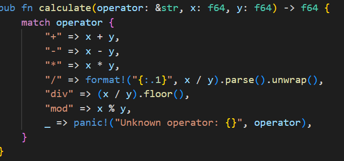
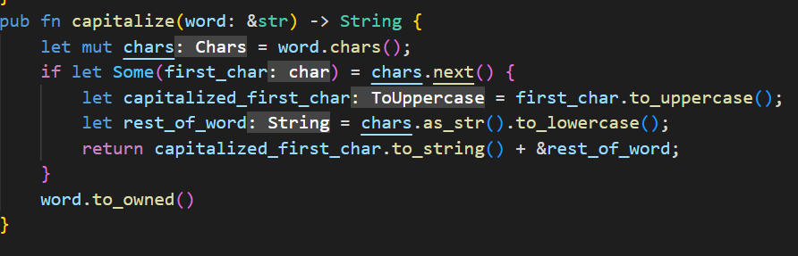
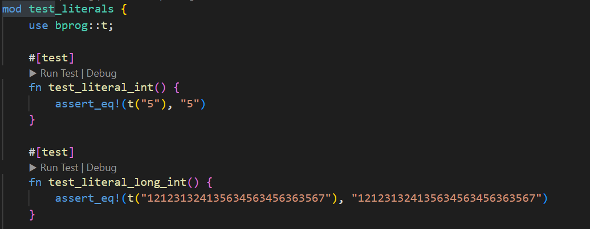
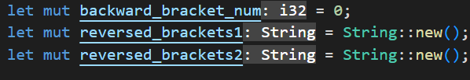
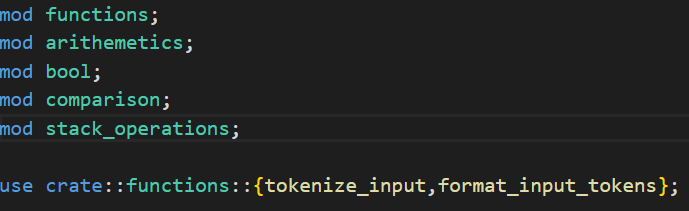
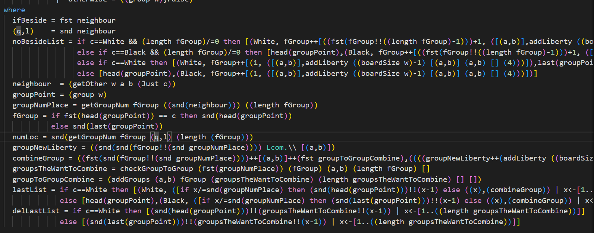
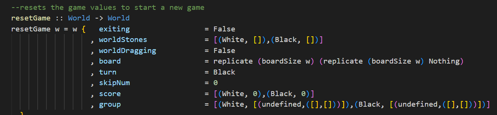
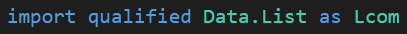

# Oblig 2

* Deadline: 21.04.2023 - 23:59

# Notes

* Keep your obligs in your workspace private until everyone submits.
* Do not make merge requests.
* Use THIS project to issue questions and review bookings. Use appropriate labels for your issues.

# What to report?

* Have you covered/read the rest of both books beyond Oblig 1?
* What have you done beyond the Oblig 1? New code? New concepts you have learned?

* How did you overcome the limitations and what was weak in Oblig 1?
   
* Prepare the Reflection document with code references. Prepare quick "show-and-tell" what you have done.
* For the "expected" content, note that:
   * Advanced Rust topics (chapters 19 and 20) are excluded.
   * Advanced Monadic topics for example monad transformers or meta programming on typeclass level are excluded. However, State Monad and the basic usage of StateT will help you with Assignment 2, so I encourage you to understand.

# Example areas

## Fundamental

Those are just example topics that you might be asked to elaborate on for Oblig 2. You are not expected to remember the syntax of both languages perfectly - you can look up syntax from the books, Internet or from a language playground. But you are expected to understand some (the more the better) concepts.

* Should a language has "default empty values" for data structures that have not yet been initialised, like we have in Go? What value non-initialised things have in Haskell? What values do they have in Rust? How does it work? 
* How is the idiomatic pattern to deal with errors in Rust and Haskell? How does it differ to Golang?
* How to use Maybe and Either types in Haskell? How to use Option and Result in Rust? What are similarities and what are the differences? What can you do in one language but not in the other?
* How to use containers such as Lists, Arrays, Maps, Sets? In Haskell and in Rust? What is similar and what is different? Why?
* How to implement Fibonaci lazily in Haskell and in Rust represented as infinite sequence? Can you do that in Golang, C++ or C#? Why not? 
* What are typeclasses and traits? What they are usef for?
* Can you do type inheritance in similar way to C++ and Java in Rust and Haskell? In Golang? Why? Is there a limitation?
* What questions would you add to "Fundamental" and "Advanced" categories? What would be the answer?
* What was "easy" and what was "challenging" in both assignments? What did you struggle with? And what you have really enjoyed?

## Advanced

* How can you use Applicative Functor, Functor, or Monads to:
   * make your own code simpler, more readable and easier to mainain?
   * remove the need for boilerplate code?
* How can you take advantage of the typeclasses and traits, to inforce type safety and let the compiler to help you maintain correctness and safety of your code?
* How do `sequence` and `sequenceA` work in Haskell? 
* How does `join` work in Haskell?
* How does Result type work in Rust? Can you `join` on Result of Results?
* How does actually State monad work in Haskell? Why is it useful and could you use it in Rust? What would be the limitations? 
* How generic programming in Rust differs from Haskell?
* What questions would you add to "Fundamental" and "Advanced" categories? What would be the answer? 

