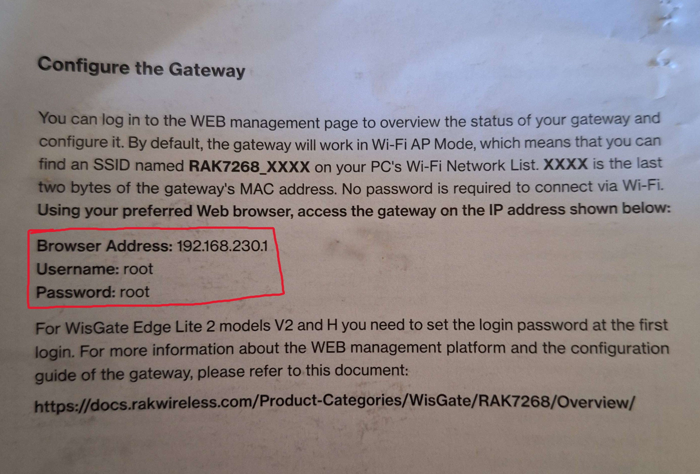
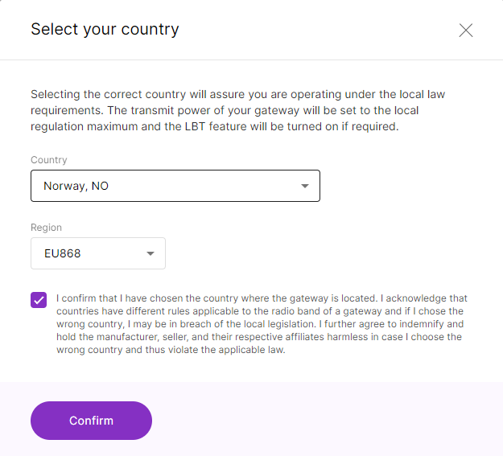
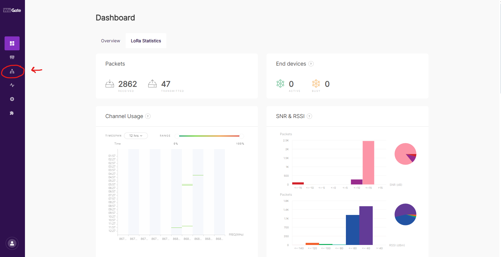
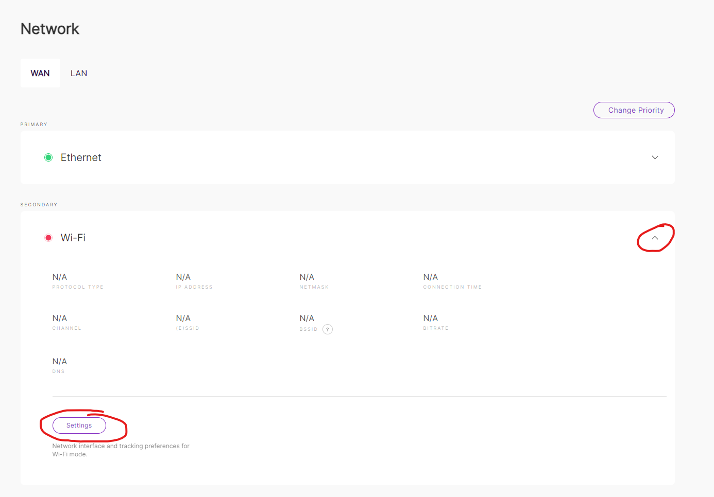
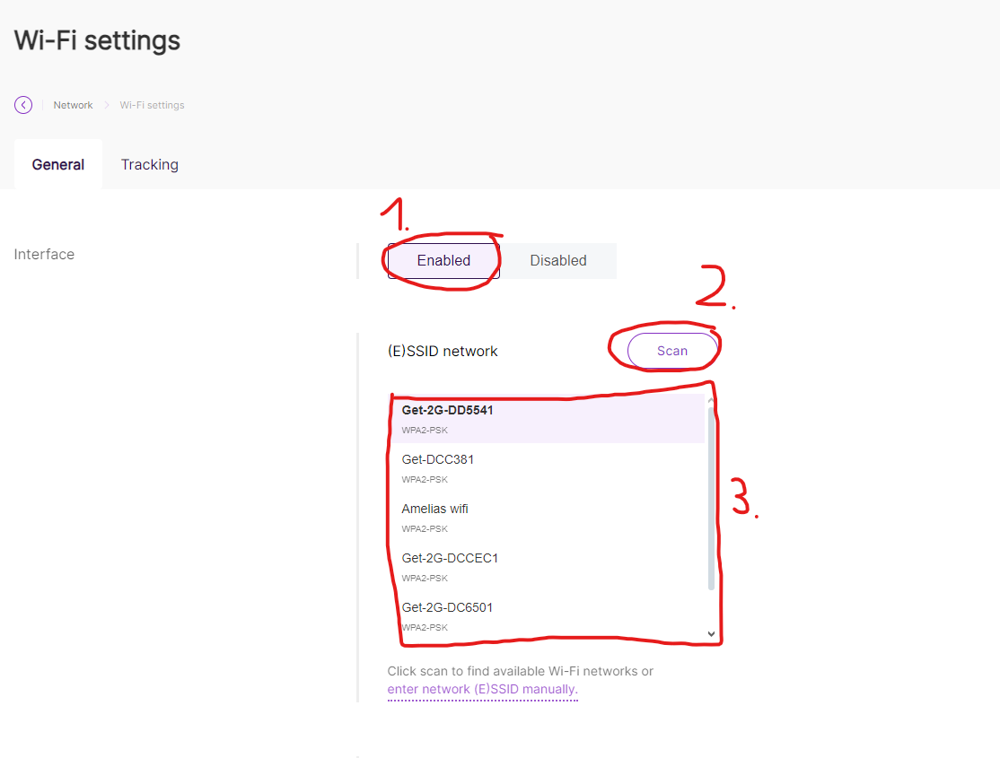
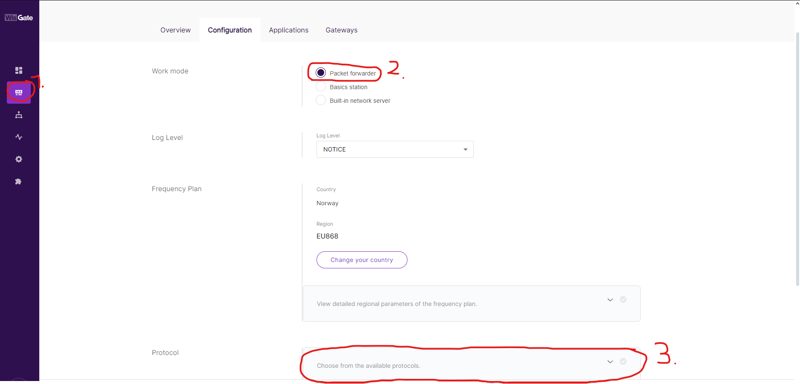
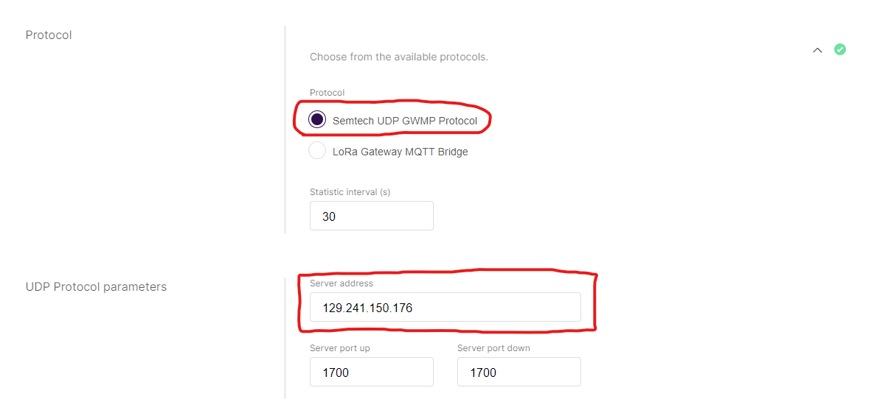
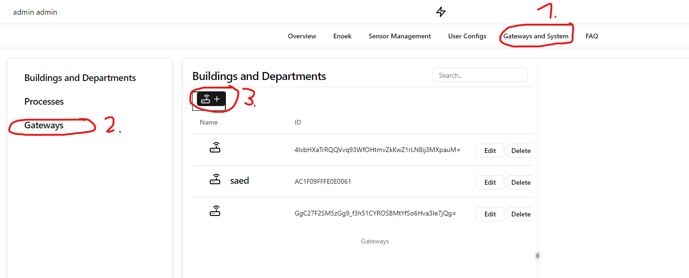
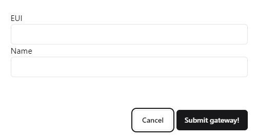
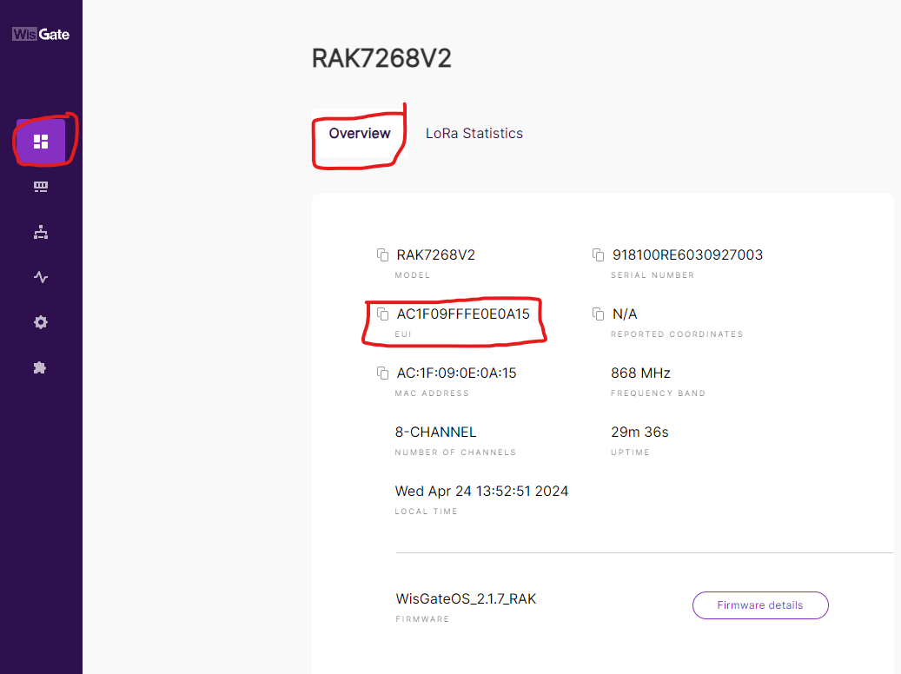

# Gateway setup
This setup uses the LoRaWAN gateway "WisGate Edge Lite 2", but other similar gateways should use similar settings.

## Opening the box
When opening the box there should be four items, the gateway itself, an antenne, a power cable and an instruction pamphlet.

Firstly, screw the antenne into the gateway, and plug in the power to the gateway. It should light up.

## Configuring internet

Then open up a laptop and connect to the network created by the gateway, named RAK7268_\<some numbers>.

Then open up a web browser and enter the browser adress shown in the image above. Log into the gateway with the username root, and password root. You might be prompted to set a password, if so, set a fitting password.

You may also be prompted to set a region, set the appropriate region, as shown on the picture below. Click save changes in the bottom right corner afterwards.

If you connect an ethernet port directly in the back you can skip to the section "configure packet forwarder"

After logging in you should be in the dashboard, clicking on where the red box below shows should enter into the internet section of the gateway.

Clicking the arrow in the red box, then settings, as shown on the image, should take you to a page.

When opening the page, click enable (1), then after saving changes, click scan (2) and then lastly find the internet connection in the red box (3). Enter network credentials and click save changes. You can test if it works by trying to use the internet while connected to the gateway-network.

## Configure packet forwarder

Clicking on configuration settings (1), then select packet forwarder (2), then scrolling down a bit, and open "choose from the available protocols" (3).

Scrolling down you should see a site looking somewhat like the picture below. Make sure "Semtech UDP GWMP protocol is selected, and then enter the ip adress "129.241.150.176" into the selection bar under "server adress", like on the image. Make sure the port up/down in 1700. Remember to click "save changes" after.

## Website configuration

Now all that remains is to add the gateway on the website. Open up the website on the link [https://powertracker.public.skyhigh.iik.ntnu.no](https://powertracker.public.skyhigh.iik.ntnu.no) and log in with your given credentials.

Clicking gateways and system (1), then gateways(2) and lastly add new gateway (3).

The EUI can be found back on the gateway page. Click the button circled in red in the image below, and then clicking "overivew", also circled in red. You can then see the EUI there, copy it into the field "EUI" on the image above. Then give the gateway a name, and click "submit gateway".

After this the gateway should have been added, and you should be able to see it under the gateways section. Now the gateway is configured and ready to go. No more setup is needed. Sensors added through the website should start sending their data.