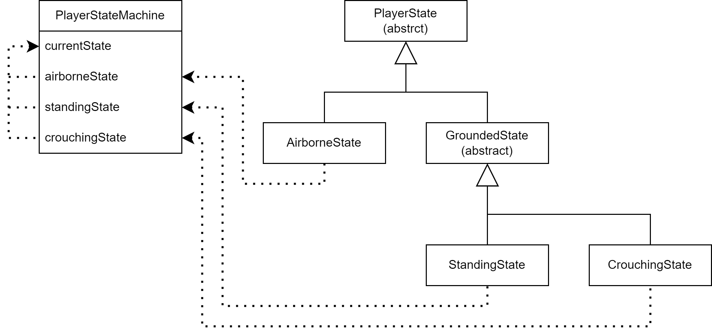

Harald Andreas Løkkeberg Hansen
============================================================

[<- Back to group report](../gameprog.md)


Grading weight
------------------------------------------------------------

| Description        | Weight |
| :---               | :---:  |
|Gameplay video      | 20     |
|Code video          | 0      |
|Good Code           | 20     |
|Bad Code            | 20     |
|Development process | 20     |
|Reflection          | 20     |

<!--
| Description        | min   | def   | max   |
| :---               | :---: | :---: | :---: |
|Gameplay video      | 5     | 10    | 20    |
|Code video          | 0     | 10    | 15    |
|Good Code           | 10    | 20    | 30    |
|Bad Code            | 10    | 20    | 30    |
|Development process | 10    | 20    | 30    |
|Reflection          | 10    | 20    | 30    |
-->


Bad code
------------------------------------------------------------

<!-- "A link to, and discussion of, code you consider bad" -->

For the bad code, I want to focus on the save and load system I implemented for saving and loading game progress to and from disk. The system works fine as it is now, but it has some design flaws that could create future problems.

### Saving method

The data is saved as plain text in a `.txt` file like this:

```
1 False 4,845707 3
2 False 20,73218 0
3 False 14,08797 1
4 False 20,90102 3
5 False 17,41834 2
6 False -1 0
7 False 16,66895 3
8 False -1 0
```

The format has each line representing a level in our game and contains the following data:

1. An `int` representing the build index of the scene that contains the level.
1. A `bool` representing if the level is locked or not. (We did not get to implement this functionality in the game, therefor all levels are always unlocked -> `False`)
1. A `float` representing the player's personal best completion time of the level. `-1` means the level is not completed.
1. An `int` representing the score (amount of stars) the player has achieved on that level.

This file can easily be edited by a user if they find it. This is cheating, but not a big problem because the game is 100% singleplayer and offline. With a multiplayer componet, we would have to store this data online and focus on security to prevent cheating and not harming the competitive component. A database could also help to make the saving format more scalable, make it easier to save more data that could be usefull, and make it easier to only read or write the data that is needed at that point. The implementation as it is now can only read the entire file when loading any data and only write all the data to the file when saving any data. The code for saving and loading data is located in [`LevelDataIO.cs`](../2D_Acrobatic_Ball/Assets/Scripts/DataStorage/LevelDataIO.cs).

### Game updates

One of the bigger problems with this implementation is that the information in the save file quickly can become incorrect when rearranging the level order or updating the requirements for getting the different amount of stars in each level.

The order in which the levels are dispayed in the main menu is the same order the scenes (levels) has in build settings. All scenes that should be included in the game are added to a list in build settings and and their order is what decides the build index of a given level. This build index is what I have used to identify levels. This build index order is often changing under development to put levels in an order that gives the game a smooth difficulty curve. The problem is that when that order changes, some or all levels has data assigned to them that belongs to another level. I have not been able to find way to uniquely identify scenes in build settings that persists scene rearranging in build settings. The scene name could be used, but this is the title of the level and is also changing during development.

The score or the amount of stars the player gets when completing a level has a similar issue with updates. The time requirement for each amount of stars in a given level is set in the inspector in the [`LevelScore`](../2D_Acrobatic_Ball/Assets/Scripts/LevelScore.cs) component on the level manager object in that scene. That information is then hard to get a hold of unless that scene is loaded. On top of that, data is only saved to disk when a level is completed and the personal best time is beaten, which means the star count stored in the save file and displayed in the main menu may be incorrect until that level's personal best time is beaten again. A better solution would be to set this time requirements outside of the level scenes somewhere, but this requires som sort of unique identifier for each scene which as said earlier, we do not have.

[`LevelDataManager.cs`](../2D_Acrobatic_Ball/Assets/Scripts/DataStorage/LevelDataManager.cs) is where data from save file is stored in memory and where saving and loading is initiated. The saving related functions `UpdateLevelScore(int starCount)` and `UpdateTime(float newTime)` are only called when the player completes a level. Time requirements for stars is set in [`LevelScore.cs`](../2D_Acrobatic_Ball/Assets/Scripts/LevelScore.cs) as mentioned. 

### Read and write

There is nothing that makes sure that the game finishes reading or writing to/from the save file before trying to read/write again. At one point, it was possible do an action that resulted in writing data to the save file, and then do another action that reads the file which caused an exception if you got there quick enough (In the main menu: Clicking "reset save file" in settings and then navigate to the level select screen fast). This happened because the `StreamWriter` (in `SaveLevelData(...)` in [`LevelDataIO.cs`](../2D_Acrobatic_Ball/Assets/Scripts/DataStorage/LevelDataIO.cs)) was not closed before the `StreamReader` (in `LoadSaveFileData()` in [`LevelDataIO.cs`](../2D_Acrobatic_Ball/Assets/Scripts/DataStorage/LevelDataIO.cs)) wanted to access the file. After manually closing the `StreamWriter` (`writer.Close();`), I was not able to reproduce this exception, but I man not certain the problem is fixed by this. I spent some time trying to find a way to stop the user from being able to do anything until the saving or loading was complete, but was not successfull and moved on.


Good code
------------------------------------------------------------

<!-- "A link to, and discussion of, code you consider good" -->

For the good code, I want to focus on the code related to the camera because this is where i had to think outside the box the most. Unity has a package called [Cinemachine](https://docs.unity3d.com/Packages/com.unity.cinemachine@2.3/manual/index.html) that does a lot of camera behaviour for you. I decided not to use it because I thought the camera behaviour we needed would be very simple and not benefit from using this package, but the scope of what the camera should be able to do grew while I was implementing this from scratch and made me rethink this decision. I decided to continue implementing it from scratch and I am happy with what I was able to implement.

The camera behaviour ended up consisting of the following:

- Having the camera follow the player with some smoothing on the camera movement.
- Having the camera follow the midpoint between the player and the ball when the ball is thrown to keep both on screen.
- Having the camera zoom out if the distance between the player and the ball approaches the screen size (and zooming in again when the distance shrinks).
- Specify some boundaries as a square around the edges of the level which the camera can not cross.
- Stoping the camera from zooming out beyond the camera boundaries, and keeping the player on screen if the distance between the player and the ball is too big.
- Camera/screen shake

The main part of camera behaviour logic located in [`CameraFollow.cs`](../2D_Acrobatic_Ball/Assets/Scripts/Camera/CameraFollow.cs). [`CameraBounds.cs`](../2D_Acrobatic_Ball/Assets/Scripts/Camera/CameraBounds.cs) contains logic related to camera boundaries which `CameraFollow.cs` uses.

### Zooming

The camera zooming was a bit difficult to get working. The zoom logic is called after the camera position is updated each frame and based on the new player position. The function `Zoom(...)` bellow handles this zooming. First, it checks if the ball exists and if not, the default zoom value is used. Then it checks how zoomed out the camera needs to be in both x and y direction and chooses the largest. This value can be used if there is no camera boundaries. If there is, this value is clamped to not be larger than what the boundaries will allow. Then the camera is repositioned to be inside the boundaries, and stays with the player if the distance between the player and the ball is bigger than what the boundaries can allow the zoom to be. One improvement here could be to check if camera needs to be repositioned before calling `RepositionCamera()` at the end of the function.

```cs
private void Zoom()
{
    if (playerRef.GetBall() == null)
    {
        mainCamera.orthographicSize = DEFAULT_VERTICAL_SIZE;
        return;
    }

    float newOrthographicSize = Mathf.Max(
        ZoomAxis(true, HorizontalOrthographicSize() - zoomZone.x, Mathf.Abs(mainCamera.transform.position.x - GetPlayerPos().x)),
        ZoomAxis(false, mainCamera.orthographicSize - zoomZone.y, Mathf.Abs(mainCamera.transform.position.y - GetPlayerPos().y)));

    if (!levelHasCameraBounds) mainCamera.orthographicSize = newOrthographicSize;
    else
    {
        mainCamera.orthographicSize = cameraBounds.ClampCameraOrthographicSize(newOrthographicSize, mainCamera.aspect);
        RepositionCamera();
    }
}
```

The `ZoomAxis(...)` function was originally two seperate functions for each axis, but I managed to merge them together to prevent some repetition. The difficult part was that the `orthographicSize` (the "zoom value") is the vertical distance from camera center to the camera edge, but I also need to check the horizontal/x direction. The horizontal distanse is found by using the `aspect`. I was able to merge these two functions into one by adding the first parameter `bool xAxis` to specify which axis is checked, which is a bit silly but it works.

```cs
private float ZoomAxis(bool xAxis, float deadZone, float positionDifference)
{
    // IF player/ball is outside dead zone
    if (positionDifference > deadZone)
    {
        float diff = positionDifference - deadZone;
        if (xAxis) diff /= mainCamera.aspect;
        return mainCamera.orthographicSize + diff;
    }

    // IF player/ball is inside dead zone AND camera is zoomed out more than default
    else if (mainCamera.orthographicSize > DEFAULT_VERTICAL_SIZE)
    {
        float diff = deadZone - positionDifference;
        if (xAxis) diff /= mainCamera.aspect;
        return mainCamera.orthographicSize - diff;
    }

    // IF player/ball is inside dead zone AND camera is zoomed in more than default
    return DEFAULT_VERTICAL_SIZE;
}
```

Another thing about the `ZoomAxis(...)` function: The zooming starts when the player and ball is a certain amount of units away from the edge of the screen, or "outside the dead zone". The function first checks if the camera should zoom out. Then if not, if it should zoom in. If this also is not the case, it returns the default zoom value.

<!--
I also think camera shake turned out pretty good. I followed a YouTube video ([https://www.youtube.com/watch?v=fn3hIPLbSn8](https://www.youtube.com/watch?v=fn3hIPLbSn8)) where I copied and modified the `CameraShaker` class which handles all the currently active camera shakes. The video also talks about how to achieve camera shakes with different algorithms without giving any code implementations. With that knowledge, I was able to create two decent camera shake implemenations. The first was [`GroundHitShake.cs`](../2D_Acrobatic_Ball/Assets/Scripts/Camera/CameraShake/GroundHitShake.cs) which is short, starts at max intencity and smoothly fades out. It took some time to 
[`RoarShake.cs`](../2D_Acrobatic_Ball/Assets/Scripts/Camera/CameraShake/RoarShake.cs)
-->


Reflection
------------------------------------------------------------

<!-- "A personal reflection about the key concepts you learnt during the course" -->

I feel like I have learned a lot in this course. I have taken less cources than normal this semester which gave me the ability to spend more time learning and testing things in this cource and not stress to much, which was nice. The key concepts I learned were related to programming, game engine and game design.

**State machine** is probably the biggest new concept I learned. I had looked at it once before this cource, but did not fully understand it and were not able to implement it. For this game, I had originally created a [`PlayerController`](../2D_Acrobatic_Ball/Assets/Scripts/PlayerController.cs) script that contained all the movement logic, and  after a while moved this over into a state machine implemenation. I doubted if the state machine was a good idea while implementing it since i would not eliminate that many if-checks. The state machine ended up making the the player movement code more readable by appropriately grouping certain logic together into different state classes. These states were organised into a binary tree where the leaf nodes are the movement states the player can have (see image bellow). I think this turned out pretty nice.

<br>

**Execution order** in Unity caused some issues. The order in which the different `MonoBehaviour`'s [event functions](https://docs.unity3d.com/Manual/ExecutionOrder.html) like `Update()` are called usualy does not matter, but I discovered are very important in some cases. One such case was that camera and parallax background movement can jitter if the execution order is wrong. Camera movement is based on player movement and therefor the camera has to be updated after the player. The patallax background is then again based on the camera movement and has to be updated after the camera. If the parallax background updates before the camera (which it depends on), then it is working with the camera state from the previous frame and results in the background jittering because the time between each frame varies.

**Singleton** was a new concept for me. I did not implement any sigleton classes, but I had to interact with some of them and got a decent understanding of the concept that way. I see how they prevent having multiple instances of that class and that it is important in certain cases. I also see how it can create more dependencies and make it hardet to decouple the code.

**Play testing** is something I think I should have done more of and more regularly. I only did it two times during the project. The second time was not too far of the deadline, and here there was discovered some bugs that were somewhat game breaking. If these were dircovered earlier, we could have used more of the time closer to the deadline to make more or better levels that uses and showcases the machanics we implemented better.

Overall, lots of things could have been better but I am very happy with the game we were able to make.