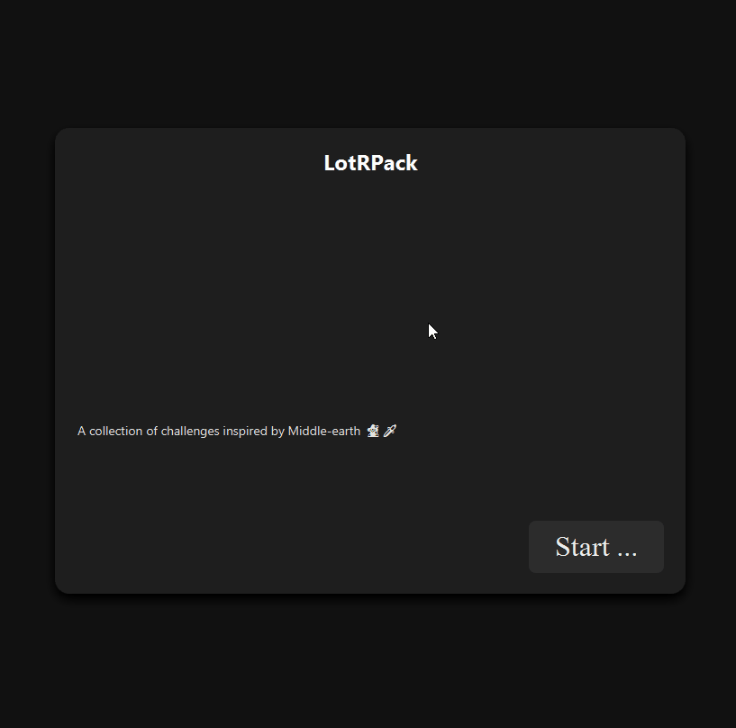
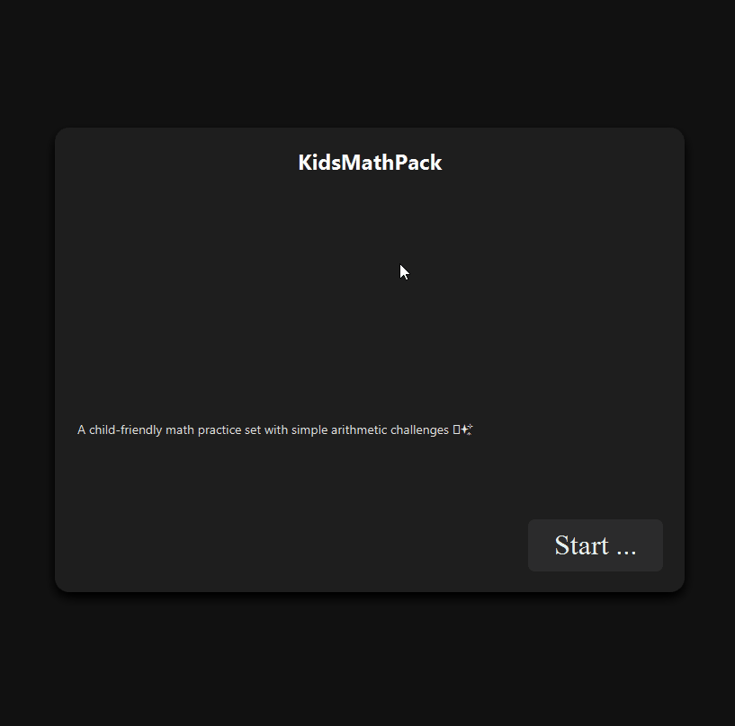
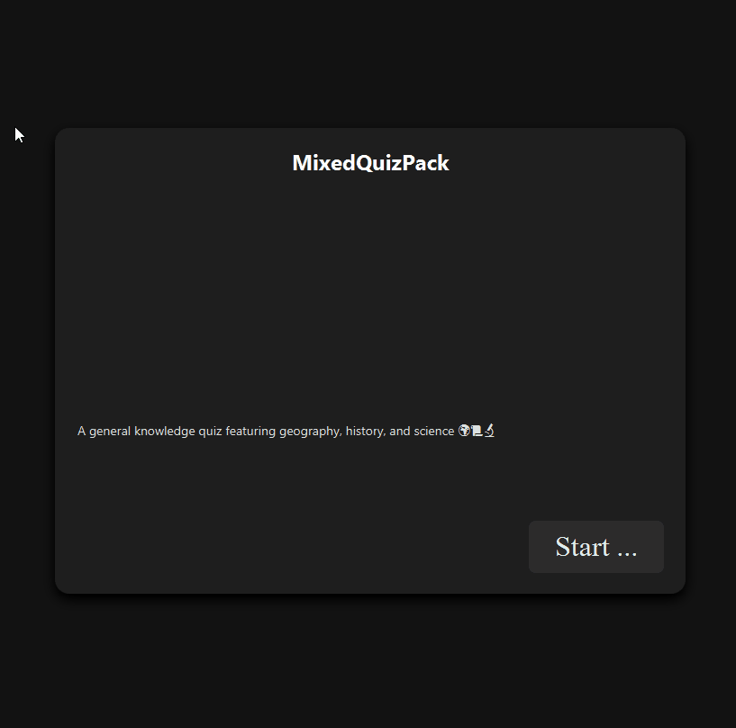
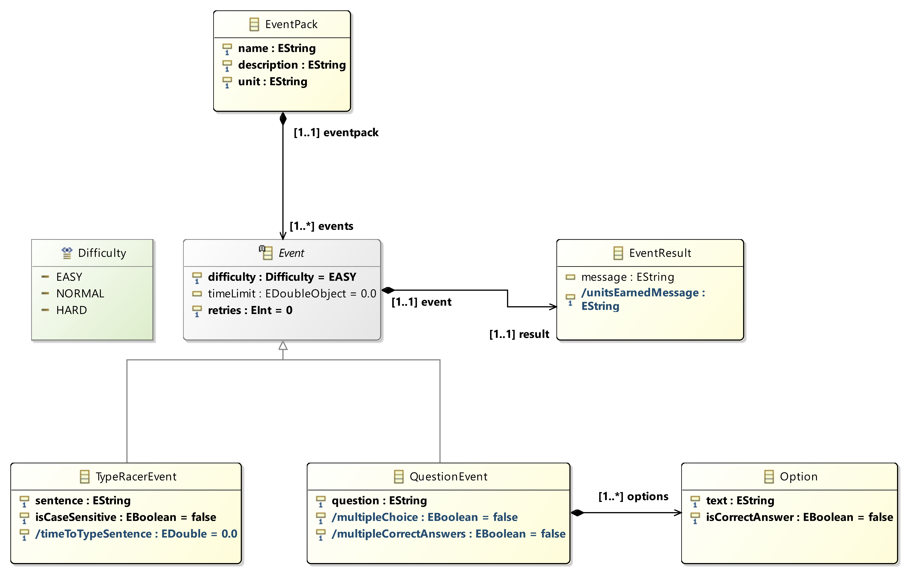

# Event Pack SPL

The metamodel is created to be used for an _Event Pack Software Product Line (SPL)_. The event pack should be used in the context of a game engine called _RealmForge_. RealmForge is a text-adventure engine written in Java, and uses JavaFX for graphics.

The idea behind event packs is to enable the creation of unique collections of events for use with the existing RealmForge text-adventure engine. As the player progresses through the game, events would be triggered according to what is defined in the model.

At the moment, these events are not integrated into the original RealmForge adventure. A full integration would require much more work as RealmForge already is a complex system. We instead wanted to prioritized the code-generation workflow and the creation of runnable examples, which we considered more important for the project.

The result is a standalone event runner that demonstrates the concept. While it is separate from the main game, it can still be launched from the RealmForge application. It also serves as a proof of concept that could be integrated into the main RealmForge adventure game in the future.

### More About the Event Packs

Like mentioned earlier, an Event Pack is a collection of events. You can have two different kind of events:

-   **TypeRacer events:** These will test the typing skills of the player, which has to type the given sentence quickly enough to proceed.
-   **Question events:** This event will ask the player a question. The player has to answer either by selecting one or many options, or typing an answer.

The results of these events will be presented to the user. The player is also given a reward if they succeed. The harder the event, the greater the reward.

## Table of Contents

- [Event Pack SPL](#event-pack-spl)
  - [More About the Event Packs](#more-about-the-event-packs)
- [Table of Contents](#table-of-contents)
- [Examples](#examples)
- [Project Structure](#project-structure)
- [How to Set Up and Use](#how-to-set-up-and-use)
  - [Running the Generator](#running-the-generator)
  - [Running the Game](#running-the-game)
  - [How to Play 🕹️](#how-to-play-️)
- [The Metamodel](#the-metamodel)
  - [EventPack](#eventpack)
  - [Event](#event)
  - [EventResult](#eventresult)
  - [TypeRacerEvent](#typeracerevent)
  - [QuestionEvent](#questionevent)
  - [Option](#option)
- [The DSL](#the-dsl)
- [Constraints](#constraints)
- [Code Generation](#code-generation)
  - [EventHandlerGenerator](#eventhandlergenerator)
  - [EventPackCssGenerator](#eventpackcssgenerator)
- [Appendix](#appendix)
  - [Implementations of Derived Attributes](#implementations-of-derived-attributes)
  - [OCL Constraints](#ocl-constraints)
  - [Comparison between generated and customized Xtext grammar](#comparison-between-generated-and-customized-xtext-grammar)

---

## Examples

<!-- Må kanskje endre på størrelse for hver GIF? -->

Here is an example of three different event packs.


<div style="display: flex; justify-content: center; text-align:center"> 
	
	
	 
</div>

	
## Project Structure

Central projects:

```
+---no.ntnu.tdt4250.rf                        \\ Metamodel as well as OCL constraints
|   +---model
|      +---rf.ecore                           \\ Contains the metamodel, as well as constraints
|
+---no.ntnu.tdt4250.rf.genjava                \\ The code generators (using Xtend)
|   +---src
|      +---EventExtensions.xtend
|      +---EventPackCssGenerator.xtend
|      +---EventPackGameHandlerGenerator.xtend
|      +---QuestionEventGenerator.xtend
|      +---TypeRacerEventGenerator.xtend
|
+---xtext-examples
|   +---src                                         \\ Example intances (using our DSL, created with Xtext)
|      +---EasyMathEventPack.rfdsl
|      +---LordOfTheRingsEventPack.rfdsl
|      +---MixedQuizEventPack.rfdsl
|   +---src-gen                                     \\ Generated code
|      +---EventHandler.java                        \\ Event Hander (logic for running the events)
|      +---minigame.css                             \\ Generated CSS (styling)
|
+---no.ntnu.tdt4250.rf.rfdsl
|   +---no.ntnu.tdt4250.rf.generator
|      +---RealmForgeDslGenerator.xtend             \\ Generator that triggers code generation on instance changes
|   +---no.ntnu.tdt4250.rfdsl
|      +---RealmForgeDsl.xtext                      \\ Xtext-based grammar for our RealmForge DSL (rfdsl)
|
+---RealmForge                                      \\ The Realm Forge game
|   +---src/main                                
|      +---java
|         +---no.ntnu.idatg2001
|            +---Main.java                          \\ Entry point for lanching RealmForge
|         +---no.ntnu.idatg2001.backend.gameevent
|            +---EventHandler.java                  \\ Plugged-in generated code
       +---resources/css
|         +---minigame.css                          \\ Plugged-in generated css
```

## How to set up and use

Clone the repository and open the projects in Eclipse.

### Running the generator

-   Right click the `no.ntnu.tdt4250.rfdsl` project --> Run As --> Eclipse Application.
    -   You will get a warning about some problems regarding `bndtools.m2e`. _This is expected and can be ignored_.
    -   Wait for the Eclipse instance to launch.
-   Once launched, open the project, and `no.ntnu.tdt4250.xtext-examples` in the new eclipse instance.
-   The `src` folder already contains three example definitions.
    -   To create a new definition, simply create a new file with the `.rfdsl` extension and define it in the way you want to. Saving it will trigger the generator.
    -   To use one of the existing definitions, simply do some trivial change in the definition you want to use, undo it, and save the file again to trigger the generator.
-   Once the generator has run, two files will  have been created using the model: `EventHandler.java` and `minigame.css`. These files are placed in the same project under `src-gen`. The files can now be used to run the game.

### Running the game

-   To use the newly generated code, it needs to be put into the Realm Forge game. The game is in the folder `RealmForge` at the root folder.
    -   For `EventHandler.java`: Copy the file into the folder `RealmForge/src/main/java/gameevent`. RealmForge will now use the generated Event Handler to run the events.
    - For `minigame.css`: Copy the file into the folder `RealmForge/main/src/resources/css`.
-   To start RealmForge, either:
    -   Navigate to `no.ntnu.idatg2001.Main`. Right click `Main.java` --> Run As --> Java Application.
    -   Or, start it from the terminal using `mvn clean javafx:run`, while in the realmforge root directory. _This does require Maven to be installed._

### How to play 🕹️

-   Once RealmForge is launched, you will be presented with a menu.
    -   Press "New Game" and then "Play Mini Game".
    -   The game will now use the generated code to run through your defined events.

## The Metamodel
The EventPack metamodel enables creation of event packs, which are sets of "minigames". 



The following sections describe each metamodel element in detail. We will also describe selected attributes, explaing their meaning. Every attribute has a purpose and is used for code generation.  

The implementation of derived attributes are also briefly described. Code snippets of these implementations are provided in the appendix, but can of course also be found in the code in the `no.ntnu.tdt4250.rf.impl` package. 

Explanation of attributes whose purpose is self-explanatory is omitted.


### EventPack

The "root" of the metamodel, in which all other elements are contained. Represents a collection of events.

-   **name** 
-   **description** 
-   **unit:** Which "unit" the player is rewarded with. E.g. "gold", "points", "stars". This attribute is used for a derived attribute in another part of the model (see EventResult). 

### Event

An abstract class, which serves as a common representation for both event types (*TypeRacerEvent* and *QuestionEvent*).  

-   **difficulty** - Used to describe how difficult the event should be considered. The event's difficulty will affect the graphics of the event (different colors for different difficulty, see EventPackCssGenerator.xtend). It will also affect the reward the player gets for completing the event (see #eventresult). 
<br>The type of this attribute is the enumeration `Difficulty`.
-   **timeLimit** - An optional numeric value that specifies the time available for the player to complete the event.
-   **retries** - An optional number of permitted retries if the player fail in the event. Will default to 0 if not specified.

### EventResult

Represents an outcome shown after completing an event.

-   **message** - The message to show the player when completing the event.
-   **unitsEarnedMessage (derived)** - A message that tells the player what they got for completing the event. The number of units earned is based on the difficulty of the `Event`. Which unit is earned is based on the defined unit of `EventPack`.

### TypeRacerEvent 

Representation for a typing-based event where the player must type a full sentence accurately and within time. Inherits base behavior from `Event`. 

-   **sentence** - The sentence the player must type.
-   **isCaseSensitive** - Whether case mismatches count as incorrect. Defaults to false if not specified.
-   **timeToTypeSentence (derived)** - how much time the player is given to type the sentence. Based on difficulty and the length of the sentence (number of characters).

### QuestionEvent 

Representation for a question-based event where the player must answer correctly. Contains `Options` (composite relation).

**Attributes & Relationships**

-   **question**
-   **multipleChoice (derived)** - Whether more than one option has been defined. Based on the multiplicity in the relation to `Option`.
-   **multipleCorrectAnswers (derived)** - Whether more than one option is marked as correct (given there are multiple options). 

### Option

Represents a single answer option that may or may not be a correct answer. Used by `QuestionEvent`. 

-   **text**
-   **isCorrectAnswer**

## The DSL
We have defined the DSL using Xtext. Initializing an Xtext project, a grammar is automatically generated based on the model. However, we have done several customizations to make it a bit easier to use it when creating instances. This includes: 

**Getting rid of redundancy**

For example, a requirement of writing "EventPack" for every event pack should not be necessary. It is now possible to simply start with the custom name. Writing "events" before defining events is also redundant - one should simply be able to start defining events.

Before
```
EventPack returns EventPack:
	'EventPack'
	name=EString
	'{'
		'description' description=EString
		'unit' unit=EString
		'events' '{' events+=Event ( "," events+=Event)* '}' 
	'}';
```

After 

```
EventPack returns EventPack:
	'name' name=EString
	'description' description=EString
	'unit' unit=EString
	(events+=Event)*
	;
```


**Illogical placement of attributes** 

The automatically generated grammar has some weird placements of certain attributes. For example, the `isCaseSensitive` attribute was placed above the TypeRacerEvent block, instead of inside, which is not really intuitive. This was also the case for other elements. 

Before

```
TypeRacerEvent returns TypeRacerEvent:
	isCaseSensitive?='isCaseSensitive'
	'TypeRacerEvent'
	'{'
		'difficulty' difficulty=Difficulty
		('timeLimit' timeLimit=EDoubleObject)?
		'retries' retries=EInt
		'sentence' sentence=EString
		'result' result=EventResult
	'}';
```

After 

```
TypeRacerEvent returns TypeRacerEvent:
	'TypeRacerEvent'
	'{'
		(isCaseSensitive?='isCaseSensitive')?
		'difficulty' difficulty=Difficulty
		('timeLimit' timeLimit=EDoubleObject)?
		'retries' retries=EInt
		'sentence' sentence=EString
		'result' result=EventResult
	'}';
```

A full comparison between the generated and customized Xtext grammar can be found in the appendix.

## Constraints

The metamodel uses OCL (object constraint language) to ensure that no unlogical instances of the metamodel are created. These constraints will trigger if creating an invalid instance when using the DSL, and if so will show a warning. 

The purpose of most of the constraints should be quite obvious based on their names. Each constraint and its implementation can be found in the appendix. An explanation is provided for some of the more less-obvious constraints. 

The constraints can of course also be found in the code by navigating to the `rf.ecore` file (see the Project Structure section) right-clicking on it --> Open With --> OCLinEcore Editor.

## Code Generation 

We have used Xtend to implement two generators. These called from the `RealmForgeDslGenerator`, a class that was automatically generated when initializing the Xtext project. This ensures that code is generated automatically when editing instances using the DSL. The `RealmForgeDslGenerator` gets an EventPack model and passes it on to the two generators, so that they can use them to generate unique code. 

In the next sections we will provide a short explanation of each generator. 


### EventHandlerGenerator

The `EventHandlerGenerator` is responsible for generating the game logic for the event pack. It generates Java code, outputted to a file called `EventHandler.java`.

The generation is structured into four files:
* **EventHandlerGenerator:** The "main" generator file for creating the EventHandler. Contains the entry point for generation.
* **TypeRacerEventGenerator:** Generates code specific for the TypeRacer event subtype. Called by the `EventHandlerGenerator`.
* **QuestionEventGenerator:** Generates code specific for the Question event subtype. Called by the `EventHandlerGenerator`.
* **EventExtensions:** A helper class to generate code which is common to all event types. Used by the `TypeRacerEventGenerator` and the `QuestionEventGenerator`.

We have added quite a few comments in the code to explain how the generators work, particularly where the generation process takes different "paths" based on attribute values in the model. Those comments will serve as the primary documentation, so no additional details are provided here.

### EventPackCssGenerator
The CSS generator's job is to produce a complete stylesheet for the EventView based on the structure and properties that we define in the model. Instead of writing a static CSS file (with possibly unused CSS classes), the generator creates styling rules for all UI elements that are actually used for the particular instance of the metamodel. 

The generator also embeds a dynamic styling logic by generating CSS classes that matches the concepts like difficulty and event type. These classes can be applied at runtime by the controller (e.g., difficulty-hard, event-type-question). This makes it so the appeareance of the UI to adapt
automatically depending on the currently active event.

This generator has potential for further development. A natural extension would be to allow configuration of the color palette (adding hex values) and layout of the event game. Properties for this could be added to the metamodel and then utilized by the generator.

## Appendix

### Implementations of Derived Attributes
```
    // EXCERPT FROM EventResultImpl.java
    
    /**
	 * Gets the text to be displayed when winning 
	 * @generated NOT
	 */
	@Override
	public String getUnitsEarnedMessage() {
		return "You earned " + this.getNumberOfUnits() + " " + this.getEvent().getEventpack().getUnit();
	}

	/**
	 * Gets expected letters per second based on difficulty.
	 */
	private int getNumberOfUnits() {
		var difficulty = this.getEvent().getDifficulty();
		switch (difficulty) {
			case EASY: {
				return 2;
			}
			case NORMAL: {
				return 4;
			}
			case HARD: {
				return 6;
			}
			default: {
				throw new IllegalArgumentException("Unexpected value: " + difficulty);
			}
		}
	}
```

```
   // EXCERPT FROM QuestionEventImpl.java

   /**
	* <!-- begin-user-doc -->
	* <!-- end-user-doc -->
	* @generated NOT
	*/
	@Override
	public boolean isMultipleChoice() {
		return this.options.size() > 1;
	}

	/**
	 * <!-- begin-user-doc -->
	 * <!-- end-user-doc -->
	 * @generated NOT
	 */
	@Override
	public boolean isMultipleCorrectAnswers() {
		return this.options.stream()
				.filter(option -> option.isIsCorrectAnswer())
				.collect(Collectors.toList())
				.size() > 1;
	}
```

```
    // EXCERPT FROM TypeRacerEventImpl.java
    
    /**
	 * Gets the number of seconds the player has to type the sentence.
	 * This will be based on difficulty of the Event.
	 * @generated NOT
	 */
	@Override
	public double getTimeToTypeSentence() {
		var numberOfLetters = this.sentence.length();
		var lettersPerSecond = this.getLettersPerSecond();

		return numberOfLetters / lettersPerSecond;
	}

   /**
	* Gets expected letters per second based on difficulty.
	*/
	private double getLettersPerSecond() {
		switch (this.difficulty) {
            case EASY: {
                return 1.5;
            }
            case NORMAL: {
                return 3.0;
            }
            case HARD: {
                return 6.0;
            }
            default: {
                throw new IllegalArgumentException("Unexpected value: " + this.difficulty);
            }
		}
	}
```

### OCL Constraints
```
invariant EventPackMustHaveEvents: self.events->size() > 0;
```

```
invariant EventPackNameMustNotBeEmpty: self.name.size() > 0;
```

```
invariant RetriesMustBeNonNegative: self.retries >= 0;
```

```
invariant TimeLimitMustBePositiveIfSet: self.timeLimit.oclIsUndefined() or self.timeLimit > 0;
```

```
/* 
Ensures that the derived typing time of a TypeRacerEvent (computed from difficulty and length of sentence) is always shorter than the actual event time limit (set on the superclass Event).
*/
not self.timeLimit.oclIsUndefined() and self.timeLimit > self.timeToTypeSentence
```

```
invariant QuestionEventMustBeUniqueByText: self.options->isUnique(text);
```

```
invariant QuestionEventMustHaveAtLeastOneOption: self.options->size() >= 1;
```

```
invariant QuestionEventMustHaveAtLeastOneCorrectOption: self.options->exists(o | o.isCorrectAnswer);
```

### Comparison between generated and customized Xtext grammar

**Generated**
```
// automatically generated by Xtext
grammar org.xtext.example.mydsl.MyDsl with org.eclipse.xtext.common.Terminals

import "http://www.ntnu.no/tdt4250/rf" 
import "http://www.eclipse.org/emf/2002/Ecore" as ecore

EventPack returns EventPack:
	'EventPack'
	name=EString
	'{'
		'description' description=EString
		'unit' unit=EString
		'events' '{' events+=Event ( "," events+=Event)* '}' 
	'}';

Event returns Event:
	TypeRacerEvent | QuestionEvent;


EString returns ecore::EString:
	STRING | ID;

enum Difficulty returns Difficulty:
				EASY = 'EASY' | NORMAL = 'NORMAL' | HARD = 'HARD';

EDoubleObject returns ecore::EDoubleObject:
	'-'? INT? '.' INT (('E'|'e') '-'? INT)?;

EInt returns ecore::EInt:
	'-'? INT;

EventResult returns EventResult:
	{EventResult}
	'EventResult'
	'{'
		('message' message=EString)?
	'}';

TypeRacerEvent returns TypeRacerEvent:
	isCaseSensitive?='isCaseSensitive'
	'TypeRacerEvent'
	'{'
		'difficulty' difficulty=Difficulty
		('timeLimit' timeLimit=EDoubleObject)?
		'retries' retries=EInt
		'sentence' sentence=EString
		'result' result=EventResult
	'}';

QuestionEvent returns QuestionEvent:
	'QuestionEvent'
	'{'
		'difficulty' difficulty=Difficulty
		('timeLimit' timeLimit=EDoubleObject)?
		'retries' retries=EInt
		'question' question=EString
		'result' result=EventResult
		'options' '{' options+=Option ( "," options+=Option)* '}' 
	'}';

EBoolean returns ecore::EBoolean:
	'true' | 'false';

Option returns Option:
	isCorrectAnswer?='isCorrectAnswer'
	'Option'
	'{'
		'text' text=EString
	'}';
```
**Customized** 
```
// automatically generated by Xtext
grammar no.ntnu.tdt4250.rf.RealmForgeDsl with org.eclipse.xtext.common.Terminals

import "platform:/resource/no.ntnu.tdt4250.rf/model/rf.ecore" 
import "http://www.eclipse.org/emf/2002/Ecore" as ecore

EventPack returns EventPack:
	'name' name=EString
	'description' description=EString
	'unit' unit=EString
	(events+=Event)*
	;

Event returns Event:
	TypeRacerEvent | QuestionEvent;


EString returns ecore::EString:
	STRING | ID;

enum Difficulty returns Difficulty:
				EASY = 'EASY' | NORMAL = 'NORMAL' | HARD = 'HARD';

EBoolean returns ecore::EBoolean:
	'true' | 'false';

EDoubleObject returns ecore::EDoubleObject:
	'-'? INT? '.' INT (('E'|'e') '-'? INT)?;

EInt returns ecore::EInt:
	'-'? INT;

EventResult returns EventResult:
	{EventResult}
	'{'
		('message' message=EString)?
	'}';

TypeRacerEvent returns TypeRacerEvent:
	'TypeRacerEvent'
	'{'
		(isCaseSensitive?='isCaseSensitive')?
		'difficulty' difficulty=Difficulty
		('timeLimit' timeLimit=EDoubleObject)?
		'retries' retries=EInt
		'sentence' sentence=EString
		'result' result=EventResult
	'}';

QuestionEvent returns QuestionEvent:
	'QuestionEvent'
	'{'
		'difficulty' difficulty=Difficulty
		('timeLimit' timeLimit=EDoubleObject)?
		'retries' retries=EInt
		'question' question=EString
		'result' result=EventResult
		'options' '{' options+=Option ( "," options+=Option)* '}' 
	'}';

Option returns Option:
	'{'
    'text' text=EString
    (isCorrectAnswer?='isCorrectAnswer')?
  '}';
```
